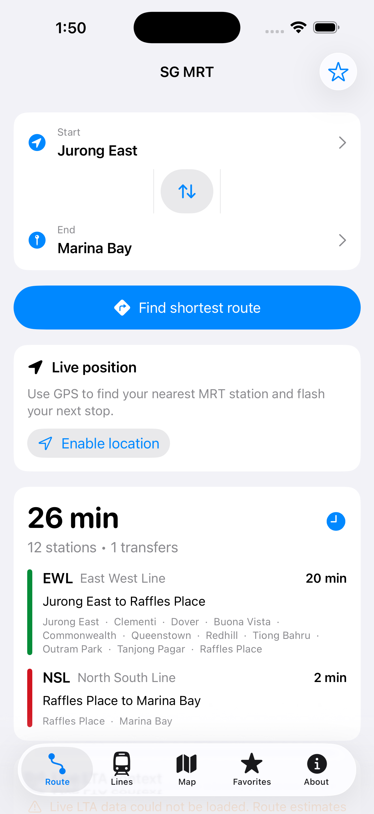

<div align="center">

# SGMRT

[](https://www.swift.org/)
[](https://developer.apple.com/ios/)
[](https://developer.apple.com/xcode/swiftui/)
[](https://developer.apple.com/xcode/)

**Singapore MRT journey planning with route estimates, map access, and live LTA context.**

[Report Bug](https://github.com/alfredang/sgmrtapp/issues) · [Request Feature](https://github.com/alfredang/sgmrtapp/issues)

</div>

## Screenshot



## About

SGMRT is a native iOS app for planning trips across Singapore's MRT network. It combines a built-in network graph, shortest-route calculation, a bundled MRT map PDF, and optional live context from LTA DataMall.

Key features:

- Shortest-route planning between MRT stations with estimated time, station count, and transfers
- Route step breakdown by MRT line
- **Lines browser** — pick any line to see its stations in running order, with interchanges marked
- **GPS live position** — detects your nearest station and flashes your next stop along the route
- **Favorites** — save a start/end journey and auto-load it on launch
- **About tab** showing the app version and build
- Live train service alerts and crowd density when an LTA key is configured
- Built-in Singapore MRT map PDF viewer
- SwiftUI tab-based interface: Route, Lines, Map, Favorites, About

## Tech Stack

| Layer | Technology |
| --- | --- |
| App | Swift 6, SwiftUI |
| Platform | iOS 17+ |
| Project | Xcode project generated from `project.yml` |
| Data | Local MRT network model, bundled MRT map PDF |
| Live services | LTA DataMall Train Service Alerts and Passenger Crowd Density APIs |

## Architecture

```text
SGMRT
├── SwiftUI App
│   ├── ContentView (tabs: Route, Lines, Map, Favorites, About)
│   ├── JourneyPlannerView + NearbyJourneyCard (GPS next stop)
│   ├── RouteSummaryView / LiveServiceView
│   ├── LinesView / LineStationsView (interchanges)
│   ├── SettingsView (favorites) / AboutView (version)
│   └── MapPDFView
├── View Model
│   └── JourneyPlannerViewModel
├── Services
│   ├── MRTNetwork / RoutePlanner
│   ├── LTADataMallClient
│   ├── LocationManager (nearest station from GPS)
│   └── FavoritesStore (UserDefaults)
├── Models
│   ├── Stations, lines, route steps, alerts, crowd density
│   └── MRTStationCoordinates
└── Resources
    └── SingaporeMRTMap.pdf
```

## Project Structure

```text
.
├── Config/
│   ├── Local.xcconfig
│   └── Secrets.xcconfig.example
├── SGMRT.xcodeproj/
├── .github/workflows/
│   └── ios-release.yml     # CI/CD: auto build + sign + upload + submit on push to main
├── SGMRTApp/
│   ├── Assets.xcassets/
│   ├── Models/             # MRT models + station coordinates
│   ├── Resources/
│   ├── Services/           # network graph, route planner, LTA client, location, favorites
│   ├── ViewModels/
│   └── Views/              # Route, Lines, Map, Favorites, About
├── ci/screenshots/         # real screenshots uploaded by CI for new versions
├── scripts/                # App Store Connect submission + CI tooling
├── .env.example
├── CHANGELOG.md            # release notes → App Store "What's New"
├── CLAUDE.md
├── SUBMISSION.md           # App Store submission workflow
├── ExportOptions.plist
├── project.yml
└── README.md
```

## Continuous delivery

Every push to `main` triggers [`.github/workflows/ios-release.yml`](.github/workflows/ios-release.yml),
which selects Xcode 26, signs with the distribution cert + App Store profile (from repo secrets),
archives, uploads to App Store Connect, and submits the current `MARKETING_VERSION` for review.
`scripts/ci_submit.py` reconciles App Store Connect to the project version — creating the next
version when the previous one is released, or updating the pending version in place.

## Getting Started

### Prerequisites

- macOS with Xcode 26 or newer
- iOS 17+ simulator or device
- Optional: LTA DataMall account key for live train alerts and crowd density

### Setup

Clone the repository:

```bash
git clone https://github.com/alfredang/sgmrtapp.git
cd sgmrtapp
```

Configure live LTA data access:

```bash
cp Config/Secrets.xcconfig.example Config/Secrets.xcconfig
```

Edit `Config/Secrets.xcconfig` and set `LTA_ACCOUNT_KEY`. The app still runs without this key, but live LTA data will not load.

Open and run the app:

```bash
open SGMRT.xcodeproj
```

Select the `SGMRT` scheme, choose an iOS simulator, and press Run.

### Command-Line Build

```bash
xcodebuild \
  -project SGMRT.xcodeproj \
  -scheme SGMRT \
  -destination 'platform=iOS Simulator,name=iPhone 17 Pro Max' \
  build
```

## Configuration

`Config/Local.xcconfig` is committed with a blank `LTA_ACCOUNT_KEY` and optionally includes `Config/Secrets.xcconfig`. Keep real API keys in `Config/Secrets.xcconfig`, which is ignored by git.

## Contributing

Issues and pull requests are welcome. For larger changes, open an issue first to discuss the route-planning, data, or UI behavior being changed.

## Developed By

Tertiary Infotech Academy Pte. Ltd.

## Acknowledgements

- Singapore Land Transport Authority for public transport data services
- Apple Developer documentation for SwiftUI and iOS app architecture
